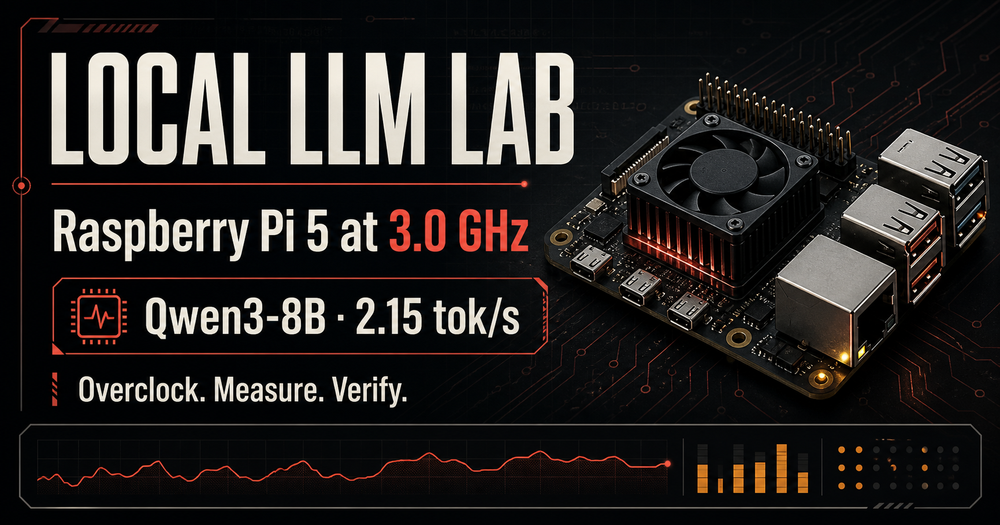
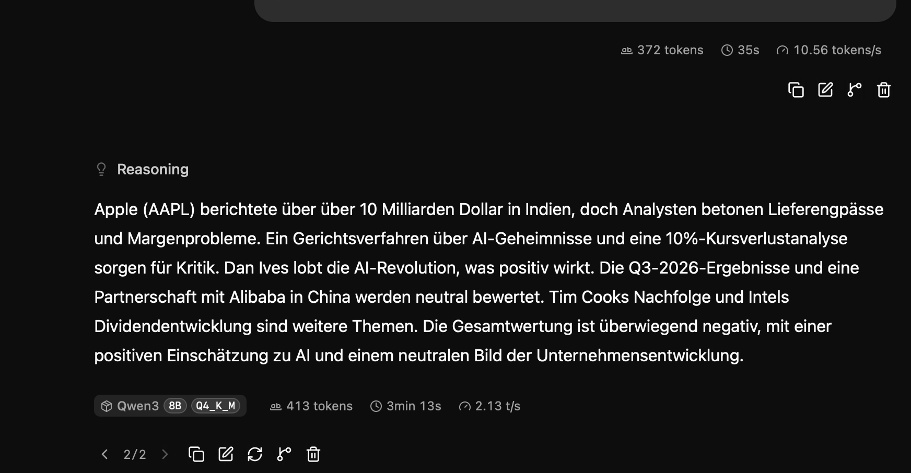
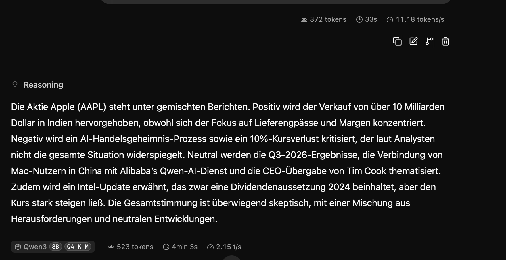
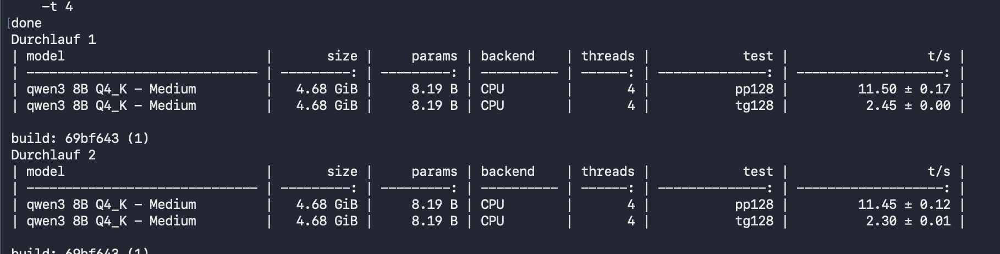

# Local LLM Lab — Raspberry Pi 5

[](https://nikoeller.github.io/raspberry-pi-local-llm-lab/)
[](https://www.raspberrypi.com/products/raspberry-pi-5/)
[](https://huggingface.co/Qwen)



A practical, measured field guide to overclocking an **8 GB Raspberry Pi 5** and running **Qwen3-8B Q4_K_M** locally with `llama.cpp`. This repository contains the full test results, the overclock configuration, reproducible benchmark commands, a systemd service example, monitoring instructions, recovery steps, and the original screenshots.

> [Open the complete interactive field guide](https://nikoeller.github.io/raspberry-pi-local-llm-lab/)

## Results at a glance

- **2.8 GHz** was the best tested daily-use profile: approximately **55 °C**, no observed throttling, and a small but repeatable speed gain over 2.6 GHz.
- The **3.0 GHz** profile completed `llama-bench` and reached **11.45–11.50 prompt tokens/s** and **2.30–2.45 generated tokens/s**.
- The model occupies **4.68 GiB** and has **8.19 billion parameters**.
- While serving the model, the Pi used about **5.2 GB of 7.87 GB RAM**, leaving approximately **2.67 GB** for the operating system, KV cache, and other processes.
- A **4096-token context** is a sensible target on this 8 GB system. Larger contexts require more KV-cache memory and can reduce responsiveness or trigger swapping.
- Increasing quantization precision does **not** normally increase tokens per second. Smaller quantizations are generally faster and use less memory; larger quantizations may improve quality at the cost of speed and RAM.

## Test system

| Component | Configuration |
|---|---|
| Board | Raspberry Pi 5, 8 GB RAM |
| CPU | 4× Arm Cortex-A76 |
| Cooling | Active cooling; measured around 55 °C at 2.8 GHz |
| Runtime | `llama.cpp`, CPU backend |
| Model | Qwen3-8B Q4_K_M GGUF |
| Model size | 4.68 GiB |
| Parameters | 8.19 B |
| Threads | 4 |
| Parallel slots | 1 |
| Web server | `llama-server`, port 8080 |
| Generation temperature | 0.2 |

## Benchmark results

| CPU clock | Method | Prompt / prefill | Generation | Notes |
|---:|---|---:|---:|---|
| 2.6 GHz | Web UI run | 10.56 tokens/s | 2.13 tokens/s | 372 prompt tokens; 413 generated tokens |
| 2.8 GHz | Web UI run | 11.18 tokens/s | 2.15 tokens/s | 372 prompt tokens; 523 generated tokens; ~55 °C; no throttling |
| 3.0 GHz | `llama-bench`, run 1 | 11.50 ± 0.17 t/s | 2.45 ± 0.00 t/s | `pp128` and `tg128` |
| 3.0 GHz | `llama-bench`, run 2 | 11.45 ± 0.12 t/s | 2.30 ± 0.01 t/s | `pp128` and `tg128` |

The 2.6 and 2.8 GHz values came from full web-interface responses. The 3.0 GHz values came from the controlled `llama-bench` tests `pp128` and `tg128`, so they are useful for validating the overclock but are **not perfectly comparable** to the UI runs.

### 2.6 GHz — web UI



### 2.8 GHz — web UI



### 3.0 GHz — llama-bench



## Recommended profiles

| Profile | CPU clock | Recommendation |
|---|---:|---|
| Stock | 2.4 GHz | Best baseline and lowest risk |
| Efficient overclock | 2.6 GHz | Conservative performance improvement |
| Daily profile | 2.8 GHz | **Recommended from these tests**: good balance of speed, temperature, and stability |
| Experimental | 3.0 GHz | Benchmark profile; validate carefully before continuous use |

Every Raspberry Pi is different. Silicon quality, cooling, power supply, storage, ambient temperature, and firmware all affect stability. A setting that works on one board is not guaranteed to work on another.

## 3.0 GHz overclock configuration

Edit the Raspberry Pi boot configuration. On current Raspberry Pi OS releases this is usually:

```bash
sudo nano /boot/firmware/config.txt
```

Add the following block:

```ini
[all]
# Add 50,000 µV to the voltage requested by the DVFS algorithm.
over_voltage_delta=50000

# Set the Arm Cortex-A76 cores to 3.0 GHz.
arm_freq=3000
```

Then reboot:

```bash
sudo reboot
```

The original proposed profile also used `gpu_freq=1000`. That setting is deliberately omitted here because this `llama.cpp` setup uses the **CPU backend**. Raising the VideoCore frequency adds heat and power consumption without a meaningful benefit for this workload. Add it only if a separate GPU workload requires it and you have tested that workload independently.

The same configuration is available as [`downloads/pi5-3ghz-config.txt`](downloads/pi5-3ghz-config.txt).

## Verify clock, temperature, voltage, and throttling

After rebooting, check that the Pi is healthy before starting a long benchmark:

```bash
vcgencmd measure_clock arm
vcgencmd measure_temp
vcgencmd get_throttled
free -h
```

For continuous monitoring:

```bash
watch -n 1 'vcgencmd measure_clock arm; vcgencmd measure_temp; vcgencmd get_throttled; free -h'
```

The ideal throttling result is:

```text
throttled=0x0
```

A non-zero value can indicate current or historical undervoltage, frequency capping, throttling, or overheating. Do not accept a faster benchmark result if the Pi is unstable or throttling.

## Run Qwen3-8B with llama-server

The detected server process used:

```bash
/home/niko/llama.cpp/build/bin/llama-server \
  -m /home/niko/models/Qwen3-8B-Q4_K_M.gguf \
  --host 0.0.0.0 \
  --port 8080 \
  -c 4096 \
  -np 1 \
  -t 4 \
  --temp 0.2
```

Key options:

- `-c 4096` sets the context window to 4096 tokens.
- `-np 1` creates one inference slot and avoids duplicating KV-cache demand.
- `-t 4` uses the four physical CPU cores.
- `--temp 0.2` produces relatively focused output.

The included [`downloads/qwen.service.example`](downloads/qwen.service.example) can be adapted into a systemd service. In this installation, the actual service name was `qwen.service`, not `llama-server.service`.

Useful service commands:

```bash
sudo systemctl edit --full qwen.service
sudo systemctl daemon-reload
sudo systemctl restart qwen.service
systemctl status qwen.service
```

## Reproduce the benchmark

Stop other CPU-heavy tasks, allow the Pi to return to a similar idle temperature, and run each test more than once.

```bash
/home/niko/llama.cpp/build/bin/llama-bench \
  -m /home/niko/models/Qwen3-8B-Q4_K_M.gguf \
  -p 128 \
  -n 128 \
  -t 4 \
  -r 2
```

In the output:

- `pp128` measures prompt processing or prefill speed.
- `tg128` measures token generation speed.
- Multiple runs help reveal instability and normal measurement variation.

For convenience, the project includes [`downloads/test-commands.sh`](downloads/test-commands.sh).

## Context size and memory

The 4.68 GiB model file does not leave the remaining RAM completely free. Runtime buffers, the operating system, the web server, and especially the KV cache also need memory. KV-cache use grows with context length, and memory pressure may lead to swapping or an out-of-memory termination.

For this setup:

- Start at **2048 tokens** when prioritizing maximum reliability.
- Use **4096 tokens** as the practical balanced setting.
- Test **8192 tokens** only while closely watching available memory and swap activity.
- Keep `-np 1`; multiple slots divide or multiply memory demands depending on the server configuration.

Changing `-c` increases the amount of conversation the model can remember. It does not make the model more intelligent, and it does not increase tokens per second.

## Quantization choice

`Q4_K_M` is a strong fit for the 8 GB Pi because it leaves meaningful headroom for the OS and KV cache. Moving to a larger quantization such as Q5 or Q6 generally:

- increases model size and RAM usage;
- reduces remaining context headroom;
- may improve output quality slightly;
- usually reduces, rather than increases, generation speed.

A smaller quantization may run faster and allow a larger context, but can reduce answer quality. The best choice depends on whether speed, context, or quality matters most.

## Stability test checklist

1. Confirm a suitable Raspberry Pi 5 power supply and active cooling.
2. Record a stock or known-stable baseline.
3. Increase the CPU clock in small steps.
4. Reboot and verify the reported clock.
5. Run `llama-bench` at least twice.
6. Generate a longer real-world response through `llama-server`.
7. Monitor temperature and `get_throttled` throughout the test.
8. Check the system journal for crashes, voltage warnings, and service restarts.
9. Only keep a profile that remains stable over longer use.

Example log checks:

```bash
journalctl -u qwen.service -b --no-pager
dmesg --level=err,warn
```

## Recovery from an unstable overclock

If the Pi fails to boot reliably:

1. Power it off completely.
2. Insert the boot medium into another computer.
3. Open `config.txt` on the boot partition.
4. Remove or reduce `arm_freq` and `over_voltage_delta`.
5. Safely eject the medium and boot again.

Keep a copy of the known-good configuration before experimenting. Overclocking can cause crashes, filesystem corruption, or hardware damage and may affect warranty or support. Proceed at your own risk.

## Repository contents

```text
.
├── README.md
├── index.html
├── styles.css
├── script.js
├── assets/
│   ├── benchmark-2-6ghz.png
│   ├── benchmark-2-8ghz.png
│   ├── benchmark-3-0ghz.png
│   └── og-local-llm-lab.png
└── downloads/
    ├── pi5-3ghz-config.txt
    ├── qwen.service.example
    └── test-commands.sh
```

## Further reading

- [Interactive Local LLM Lab guide](https://nikoeller.github.io/raspberry-pi-local-llm-lab/)
- [Raspberry Pi documentation: overclocking](https://www.raspberrypi.com/documentation/computers/config_txt.html#overclocking-options)
- [llama.cpp repository](https://github.com/ggml-org/llama.cpp)
- [Qwen on Hugging Face](https://huggingface.co/Qwen)

## Scope and methodology

These figures document one Raspberry Pi 5 and should be read as practical observations rather than universal performance guarantees. For a stricter comparison, use identical model files, prompts, context settings, thread counts, temperatures, and benchmark versions at every clock speed.


